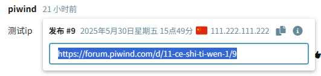

# GeoIP

 [](https://packagist.org/packages/piwind/geoip) [](https://packagist.org/packages/piwind/geoip)

A [Flarum](http://flarum.org) extension.

## About This Fork

This repository is a fork of [fof/geoip](https://github.com/FriendsOfFlarum/geoip). Just style optimizations, no functional modifications.

### 改动记录

- 优化了样式，优化后的截图看下面

### TODO

- 网络限制：中国大陆无法连接 `nominatim.openstreetmap.org`

### 备注

- 请求头限制：个别手机端点开"IP信息"按钮，控制台报错 CORS policy 阻止，状态码 403 Forbidden，但是桌面端是正常的，个例如下：

  ```
  示例请求URL：https://nominatim.openstreetmap.org/reverse?lat=30.2943&lon=120.1663&format=json
  
  对比桌面端和手机端的请求头的差异：
  sec-ch-ua-mobile【经测试与之无关】
  桌面端		?0
  手机端		?1
  sec-ch-ua-platform【经测试与之无关】
  桌面端		Windows
  手机端		Android
  
  user-agent【重点还是在UA上】
  桌面端		Mozilla/5.0 (Windows NT 10.0; Win64; x64) Safari/537.36
  失败手机端		Mozilla/5.0 (Linux; Android 6.0; Nexus 5 Build/MRA58N) Mobile Safari/537.36
  成功手机端		Mozilla/5.0 (Linux; Android 13; Pixel 7) Mobile Safari/537.36
  ```

- 成功的IP信息的请求，控制台会有两条信息：

  ```
  Blocked aria-hidden on an element because its descendant retained focus. The focus must not be hidden from assistive technology users. Avoid using aria-hidden on a focused element or its ancestor. Consider using the inert attribute instead, which will also prevent focus. 
  
  Refused to get unsafe header "X-CSRF-Token"
  ```

## Empower Your Flarum Moderators with GeoIP

Moderators play a crucial role in maintaining the health and quality of forums. With GeoIP, give them the geolocation tools they need to better understand users, make informed decisions, and maintain a safe environment. Only moderators have access to IP-based geolocation, ensuring user privacy and data security.

### 🌎 Key Features
- **Location Insights**: Enable moderators to identify the country and region of users.
- **Interactive Mapping**: Let moderators visualize user locations with an integrated map view.
- **Threat Detection**: Equip moderators with the ability to highlight potentially malicious IP addresses through threat level indicators. (Via supported IP location data providers)

### Screenshots
**Redesigned post meta info (visible to admins/mods)**
【点击帖子的发布时间会弹出帖子的详细信息，包括ip】



**Integration with session management (visible to own profile)**


**Information modal with location map**


### CLI Usage

The following CLI commands are provided:

#### `lookup`

Although IP addresses will be looked up when they are requested, this command will lookup all IP's that do not already have an entry in the `ip_info` table, using the currently selected provider.

```sh
php flarum piwind:geoip:lookup
```

#### `lookup --force`

You may also force a refresh of IP data using the currently selected provider.

```sh
php flarum piwind:geoip:lookup --force
```

### Queue offloading

The IP lookup can be time consuming, so the lookup of an unknown IP address is dispatched in a job, if you have a queue running this will run on a worker thread, rather than the main thread.

All IP address lookup jobs are dispatched to the `default` queue by default. If you have multiple queues, you can specify which queue to use for these jobs in your `extend.php`:

```
Piwind\GeoIP\Jobs\RetrieveIP::$onQueue = 'my-other-queue';
```

## Installation & Updating

Install manually with composer:

```sh
composer require piwind/geoip:"*"
```

Updating:

```sh
composer update piwind/geoip
php flarum cache:clear
```

## Links

- [Packagist](https://packagist.org/packages/piwind/geoip)
- [GitHub](https://github.com/piwind/flarum-geoip)

